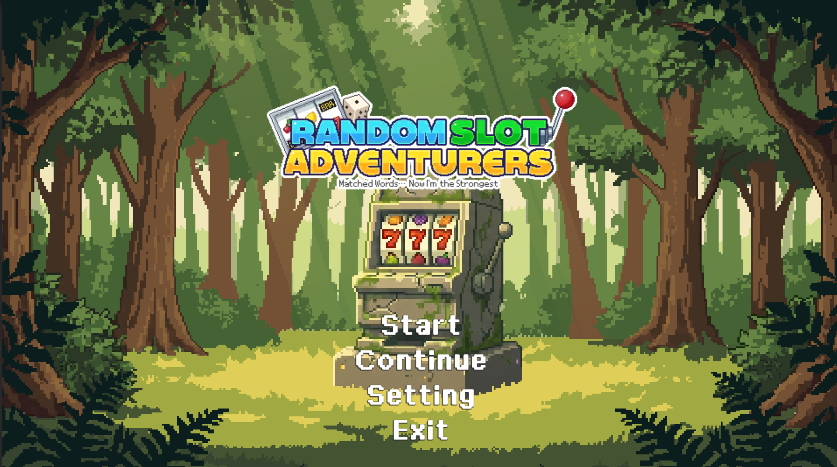
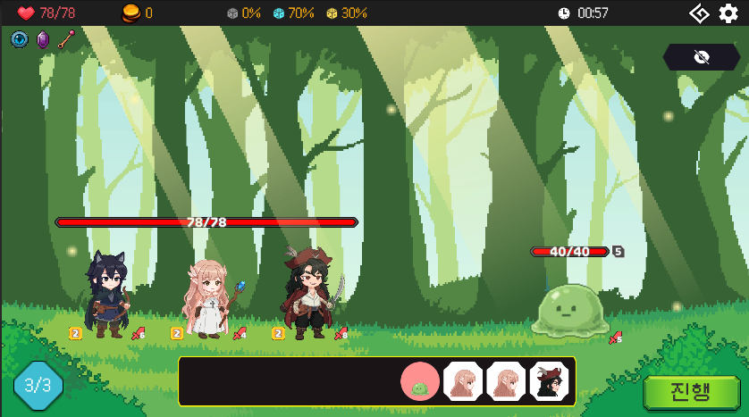
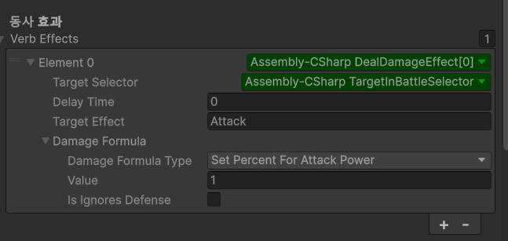
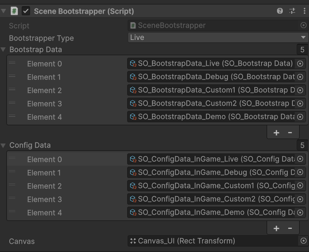
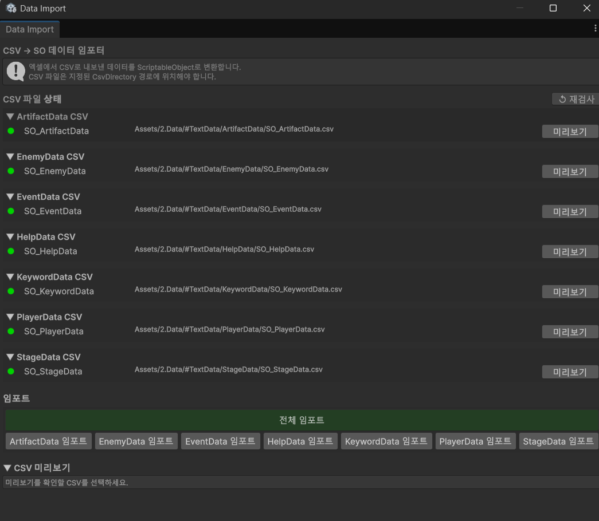

# Random Slot Adventurers

Unity로 개발한 2D 로그라이크 팀 프로젝트의 포트폴리오용 코드 샘플입니다.

## 게임 소개

**Random Slot Adventurers**는 슬롯머신의 랜덤성과 로그라이크의 선택·성장 요소를 결합한 2D 자동 전투 게임입니다. 플레이어는 모험을 진행하며 전투, 보상, 이벤트를 마주하고 매 판 달라지는 조합 속에서 파티를 운영합니다.

## 핵심 전투 방식

전투가 시작되면 슬롯머신을 돌려 하단 슬롯에 배치할 토큰을 획득합니다. 토큰의 배치 순서와 적의 속도를 함께 계산해 행동 순서가 정해지며, 이후 전투는 자동으로 진행됩니다. 어떤 토큰을 얻고 어느 순서로 배치하느냐에 따라 매 전투의 전략이 달라집니다.

## 주요 담당 업무

프로젝트의 핵심 시스템과 개발 환경을 설계·구현해, 전투 로직의 확장성과 팀 단위 개발 효율을 높였습니다.

### 1. EventBus 기반 이벤트 처리

[`EventBus`](Assets/4.Scripts/EventBus/EventBus.cs)를 도입해 시스템 간 직접 참조를 줄이고, 이벤트 발행자와 구독자를 분리했습니다.

- 제네릭 이벤트를 발행·구독하는 구조로 시스템 간 결합도 완화
- 구독 시 `IDisposable` 토큰을 반환해 해제를 명시적으로 관리
- 1회성 이벤트 구독(`SubscribeOnce`) 지원
- 이벤트 발행 중 구독 목록이 변경되어도 안전하도록 스냅샷 기반으로 순회

이를 통해 전투, UI, 보상 등 여러 시스템이 서로를 직접 의존하지 않고 필요한 시점에 반응할 수 있도록 구성했습니다.

**관련 구현**

- [`EventBus.cs`](Assets/4.Scripts/EventBus/EventBus.cs)

### 2. 자동 전투를 위한 GameAction · Effect 구조

전투에서는 슬롯 토큰, 능력, 유물 등 여러 효과가 서로 다른 타이밍에 실행됩니다. 이를 관리하기 위해 [`GameAction`](Assets/4.Scripts/GameActions/GameAction.cs)과 [`Effect`](Assets/4.Scripts/Effect/Effect.cs) 기반의 실행 구조를 구현했습니다.

- `GameAction`을 **사전 반응 → 실행 액션 → 사후 반응** 단계로 나누어 효과 순서를 표현
- `Effect`를 추상화해 대상 선택, 지연 시간, 효과 설명을 공통 데이터로 관리
- 각 효과는 Inspector에서 설정할 수 있어, 코드 수정 없이 기획 데이터 조합으로 전투 효과를 구성
- 유물과 능력이 자동 전투 흐름 안에서 일관된 순서로 작동하도록 확장 가능한 구조 설계

*Inspector에서 전투 기능 중 하나인 키워드를 여러 Effect와 기능을 조합해 구현하는 모습*

**관련 구현**

- [`GameAction.cs`](Assets/4.Scripts/GameActions/GameAction.cs)
- [`Effect.cs`](Assets/4.Scripts/Effect/Effect.cs)
- [`TargetSelector.cs`](Assets/4.Scripts/TargetSelector/TargetSelector.cs)

### 3. 개발·테스트 환경을 분리하는 SceneBootstrapper

[`SceneBootstrapper`](Assets/4.Scripts/ETC/SceneBootstrapper.cs)를 통해 씬 시작 시 필요한 오브젝트와 설정을 일관되게 초기화하도록 구성했습니다.

- `Live`, `Debug`, 개인 개발 환경, `Demo` 등 목적별 Bootstrap 데이터 선택
- 환경별 `SO_BootstrapData`, `SO_ConfigData_InGame`를 Inspector에서 연결
- `[DefaultExecutionOrder(-1000)]`로 다른 게임 로직보다 먼저 초기화하여 생명주기 경합을 방지
- 필요한 프리팹을 순서대로 생성하고 `IInitializable` 인터페이스를 통해 초기화 시점 통일
- 팀원별 테스트 환경과 실제 라이브 환경을 빠르게 전환할 수 있어 씬 충돌과 테스트 비용을 줄임

*환경별 Bootstrap 데이터와 Config 데이터를 선택하는 SceneBootstrapper Inspector*

**관련 구현**

- [`SceneBootstrapper.cs`](Assets/4.Scripts/ETC/SceneBootstrapper.cs)
- [`AppConfig.cs`](Assets/4.Scripts/Config/AppConfig.cs)
- [`SO_BootstrapData.cs`](Assets/4.Scripts/Data/SO_BootstrapData.cs)

### 4. CSV → ScriptableObject 데이터 파이프라인 및 커스텀 에디터 툴

기획 데이터 문서를 게임에서 안전하게 활용하기 위한 CSV → ScriptableObject 변환·검증 파이프라인을 설계했습니다.

- 데이터 입력·출력 구조, 검증 규칙, 오류 유형 및 사용자 흐름 정의
- `DataImporterBase` 기반의 확장 구조와 `UnifiedDataImportWindow`의 화면·기능 요구사항 설계
- AI 보조 구현을 바탕으로 결과물을 검토·통합하고, 프로젝트 데이터 구조에 맞게 적용

*CSV 상태 검사, 미리보기, 개별·전체 임포트를 지원하는 커스텀 에디터 도구*

**관련 구현**

- [`UnifiedDataImportWindow.cs`](Assets/4.Scripts/Editor/Core/UnifiedDataImportWindow.cs)
- [`DataImporterBase.cs`](Assets/4.Scripts/Editor/Core/DataImporterBase.cs)
- [`CSVParser.cs`](Assets/4.Scripts/Utils/CSVParser.cs)

### 기타 구현

전투, 슬롯머신, 맵 진행, 데이터 모델, 이펙트, 사운드, UI, 보물방 기능, 모험 이벤트 기능 등 게임의 주요 플레이 기능 구현에도 참여했습니다.
